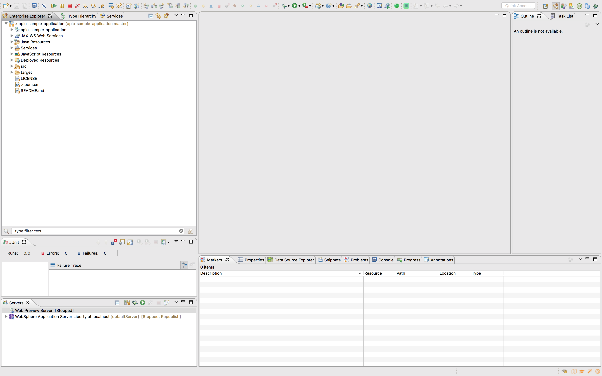
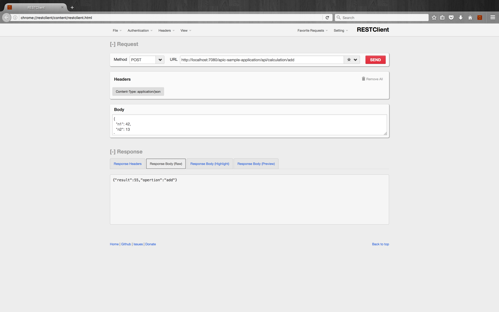
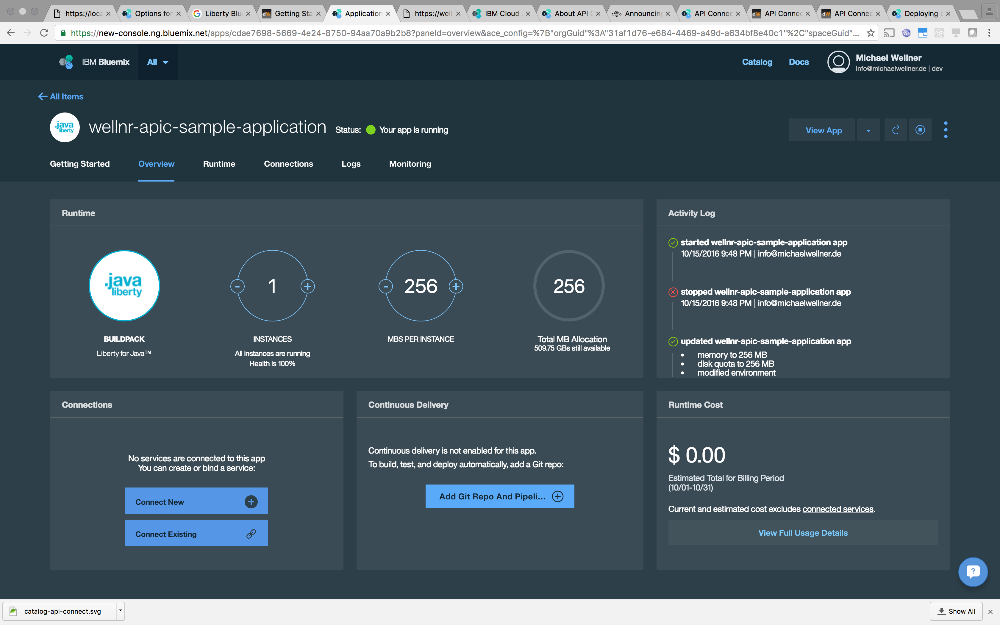
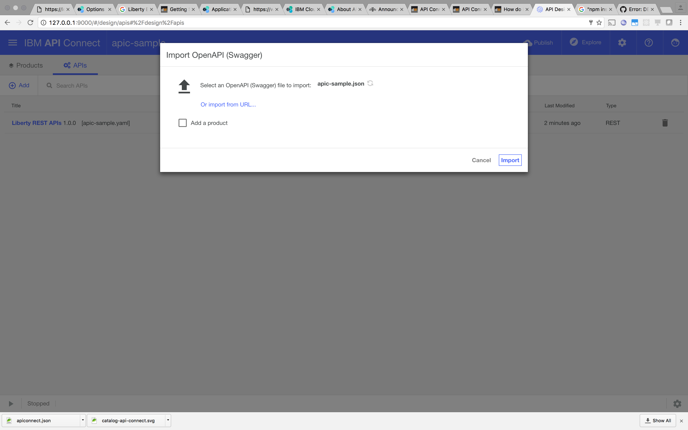
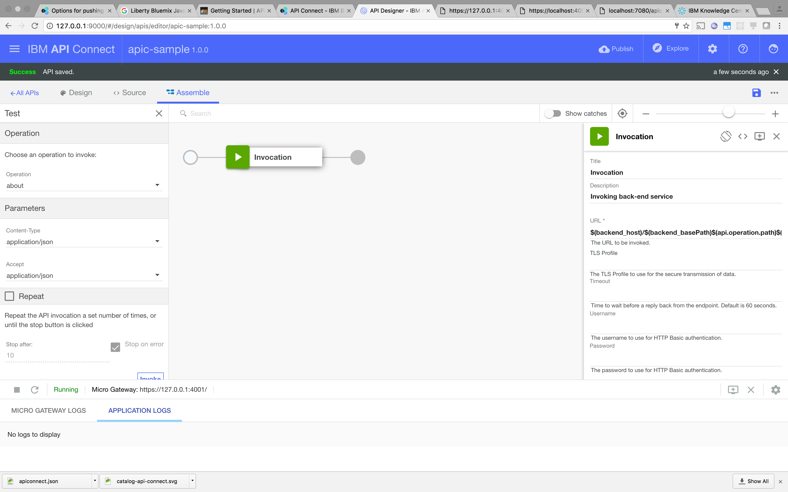

# IBM API Connect by example

## Prerequisites

* GitHub Account and installed Git client
* Eclipse for Java EE development and installed IBM WebSphere Liberty Tools
* Locally installed IBM WebSphere Liberty Profile Server with JEE7 WebProfile features.

## Import a JEE 7 JAX-RS application with IBM WebSphere Liberty Profile

* Clone the starter kit

  ```bash
  git clone git@github.com:cokeSchlumpf/wlp-jee-starter-kit.git apic-sample-application
  ```

* Edit `pom.xml` and replace the `<name>` and `<artifactId>` value with `apic-sample-application`

  ```xml
  <project>
    <!-- ... -->
    <groupId>com.wellnr</groupId>
    <artifactId>apic-sample-application</artifactId>
    <version>0.0.1-SNAPSHOT</version>

    <name>apic-sample-application</name>
    <!-- ... -->
  </project>
  ```

* Import the project into Eclipse `File > Import ... > Existing Maven project`

  

* Copy `src/wlp/resources/server.xml` to actual `server.xml`

* Deploy application to WebSphere Liberty Profile and start the server. The console should output something like:

  ```
  [AUDIT   ] CWWKT0016I: Web application available (default_host): http://192.168.1.106:7080/ibm/api/explorer/
  [AUDIT   ] CWWKT0016I: Web application available (default_host): http://192.168.1.106:7080/ibm/api/docs/subscription/websocket/
  [AUDIT   ] CWWKT0016I: Web application available (default_host): http://192.168.1.106:7080/ibm/api/
  [AUDIT   ] CWWKT0016I: Web application available (default_host): http://192.168.1.106:7080/apic-sample-application/
  ```

* Open `src/test/ws/AboutServiceITest.java` and run integration test to check if everything works fine.

## Implement a sample business asset within the JEE Application

* Create a new model class for calculation requests `model.CalculationRequest`

  ```java
  package model;

  import javax.xml.bind.annotation.XmlAccessType;
  import javax.xml.bind.annotation.XmlAccessorType;
  import javax.xml.bind.annotation.XmlElement;
  import javax.xml.bind.annotation.XmlRootElement;
  import javax.xml.bind.annotation.XmlType;

  @XmlRootElement
  @XmlAccessorType(XmlAccessType.FIELD)
  @XmlType(propOrder = { "n1", "n2" })
  public class CalculationRequest {

  	@XmlElement(name = "n1", required = true)
  	public final int n1;

  	@XmlElement(name = "n2", required = false)
  	public final int n2;

  	/**
  	 * Constructor for instantiation via JAXB
  	 */
  	@SuppressWarnings("unused")
  	private CalculationRequest() {
  		this(0, 0);
  	}

  	public CalculationRequest(int n1, int n2) {
  		this.n1 = n1;
  		this.n2 = n2;
  	}

  }
  ```

* Create a new model class for Calculation results `model.CalculationResult`

  ```java
  package model;

  import javax.xml.bind.annotation.XmlAccessType;
  import javax.xml.bind.annotation.XmlAccessorType;
  import javax.xml.bind.annotation.XmlElement;
  import javax.xml.bind.annotation.XmlRootElement;
  import javax.xml.bind.annotation.XmlType;

  import util.BaseObject;

  @XmlRootElement
  @XmlAccessorType(XmlAccessType.FIELD)
  @XmlType(propOrder = { "operation", "result" })
  public class CalculationResult extends BaseObject {

  	@XmlElement(name = "opertion", required = true)
  	public final String operation;

  	@XmlElement(name = "result", required = true)
  	public final int result;

  	/**
  	 * Constructor for instantiation via JAXB
  	 */
  	@SuppressWarnings("unused")
  	private CalculationResult() {
  		this(null, 0);
  	}

  	public CalculationResult(String operation, int result) {
  		this.operation = operation;
  		this.result = result;
  	}

  }
  ```

* Create a new class `ws.CalculationService`

  ```java
  package ws;

  import javax.ejb.Stateless;
  import javax.ws.rs.Consumes;
  import javax.ws.rs.GET;
  import javax.ws.rs.POST;
  import javax.ws.rs.Path;
  import javax.ws.rs.Produces;
  import javax.ws.rs.QueryParam;
  import javax.ws.rs.core.MediaType;

  import io.swagger.annotations.Api;
  import model.CalculationRequest;
  import model.CalculationResult;

  @Stateless
  @Path("calculation")
  @Consumes(MediaType.APPLICATION_JSON)
  @Produces(MediaType.APPLICATION_JSON)
  @Api("calculation-service")
  public class CalculationService extends AbstractService {

  	private final String ADD = "add";

  	@GET
  	@Path(ADD)
  	public CalculationResult add(@QueryParam("n1") int n1, @QueryParam("n2") int n2) {
  		return new CalculationResult(ADD, n1 + n2);
  	}

  	@POST
  	@Path(ADD)
  	public CalculationResult add(CalculationRequest request) {
  		return new CalculationResult(ADD, request.n1 + request.n2);
  	}

  	@GET
  	@Path("example")
  	public CalculationRequest example() {
  		return new CalculationRequest(42, 13);
  	}

  }
  ```

* Extend the class `ws.Application`

  ```java
  package ws;

  import java.util.Set;

  import javax.ws.rs.ApplicationPath;

  import com.google.common.collect.Sets;

  @ApplicationPath("api")
  public class Application extends javax.ws.rs.core.Application {

  	@Override
  	public Set<Class<?>> getClasses() {
  		return Sets.newHashSet( //
  				AboutService.class, //
  				CalculationService.class);
  	}

  }
  ```

* Publish the application locally and test it:

  * `http://localhost:7080/apic-sample-application/api/calculation/example`
  * `http://localhost:7080/apic-sample-application/api/calculation/add?n1=10&n2=12`

  * 

## Deploy the application to Bluemix

* Create a `manifest.yml` file to prepare push to Bluemix

  ```yml
  applications:
  - path: ./target/apic-sample-application.war
    name: ${REPLACE_THIS_WITH_A_NICKNAME}-apic-sample-application
    memory: 256M
    disk_quota: 256M
  ```

  More information about the the contents of a `manifest.yml` can be found in the [Bluemix Docs](https://new-console.ng.bluemix.net/docs/manageapps/depapps.html#deployingapps).

* Login using CF CLI

  ```bash
  cf login -a api.ng.bluemix.net -u ${BLUEMIX_USERNAME} -p ${BLUEMIX_PASSWORD}
  ```

* Push the Application to your Bluemix

  ```bash
  cf push
  ```

* Check Application

  

* Optional: Configure Mutual TLS to avoid unauthorized direct calls to the API. See [dwAnsers](https://developer.ibm.com/answers/questions/16016/how-do-i-enforce-ssl-for-my-bluemix-application.html) to see how HTTPS is enforced to Liberty applications on Bluemix.

  * https://developer.ibm.com/apiconnect/2016/07/06/securing-apic-bm-app-mutual-tls/

    ```bash
    openssl req -newkey rsa:2048 -nodes -keyout clientPrivate.key -x509 -days 365 -out clientPublic.crt -subj "/C=CH/O=IBM/CN=API Connect Sample"
    openssl pkcs12 -inkey clientPrivate.key -in clientPublic.crt -export -out clientCert.p12
    ```

  * http://stackoverflow.com/questions/17448365/how-to-make-htts-redirect-work-on-websphere-application-server-liberty-profile

Further information about pushing apps to Bluemix can be found in [Bluemix Docs](https://new-console.ng.bluemix.net/docs/runtimes/liberty/optionsForPushing.html#stand_alone_apps). There are also information about [Supported Liberty Features on Bluemix](https://new-console.ng.bluemix.net/docs/runtimes/liberty/libertyFeatures.html).

## Create the API with API Designer

* Create a new local project directory `apic-sample`

  ```bash
  mkdir apic-sample
  ```

* Visit `https://localhost:7443/ibm/api/docs/apiconnect` to retrieve your API Definition and save the content to the local machine as `apic-sample.json`.

* If not done, install API Connect Developer Toolkit

  ```bash
  npm install -g apiconnect
  ```

* Run the API Designer and login with Bluemix credentials when requested.

  ```bash
  apic edit
  ```

* On the APIs tab select `Add > Import an existing Open API` and upload the downloaded definition to create the API.

  

* Edit the values on the API Designer

  * Title: `apic-sample`
  * Name: `apic-sample`

  * Schemes: `https`
  * BasePath: `/apic-sample/v1.0`
  * Consumes: `application/json`
  * Produces: `application/json`

  * Adopt paths: Remove `/apic-sample-application/api` from paths.

* Create properties:
  * `backend_basePath`
    * Description: `The base path of the application in the backend (without leading slash).`
    * Default value: `/apic-sample-application/api`
  * `backend_host`
    * Description: `The Host of the actual API.`
    * Default value: `http://localhost:7080`

* Modify samples

* Edit the assembly policy:

  * `$(backend_host)/$(backend_basePath)$(api.operation.path)$(request.search)`. See [IBM Knowledge Center](https://www.ibm.com/support/knowledgecenter/SSFS6T/com.ibm.apic.toolkit.doc/rapim_context_var.html) for a full list of context variables.

* Run & Test assembly

  

* Create API Product

## Create, configure and publish to API Catalog

  * Within API Connect on Bluemix: Create a catalog `apic-sample-sandbox`
  * Walk through configuration: Create Developer Portal, Enable Sandbox
  * Publish product to API via Designer
  * Publish API within Catalog on Bluemix
  * Test `https://wellnr-apic-sample-application.mybluemix.net/api/about` the API --> Error

  * Fix bugs in the API
    * Adjust `backend_basePath` for catalog `apic-sample-sandbox` to `api`
    * Adjust `backend_host` for catalog `apic-sample-sandbox` to `https://wellnr-apic-sample-application.mybluemix.net`

  * Test `https://wellnr-apic-sample-application.mybluemix.net/api/about` again -> Fine

## Configure API Security

  * Add Security Definition `API Key`
    * Name: `clientSecretHeader`
    * Parameter name: `X-IBM-Client-Secret`
    * Located in Header
  * Add Security Definition `API Key`
    * Name: `clientIdHeader`
    * Parameter name: `X-IBM-Client-Id`
    * Located in Header
  * Enable Security Definitions in Security Section
  * Check if all Paths are set to `Use API Security Section`

  * Test locally
  * Test via Developer Portal and curl/ Firefox RESTClient

## Do remaining steps
  * Access the developer portal and generate Client Key & Secret
  * Extend the API
  * Supersede the API on Bluemix
  * See the Analytics dashboard
